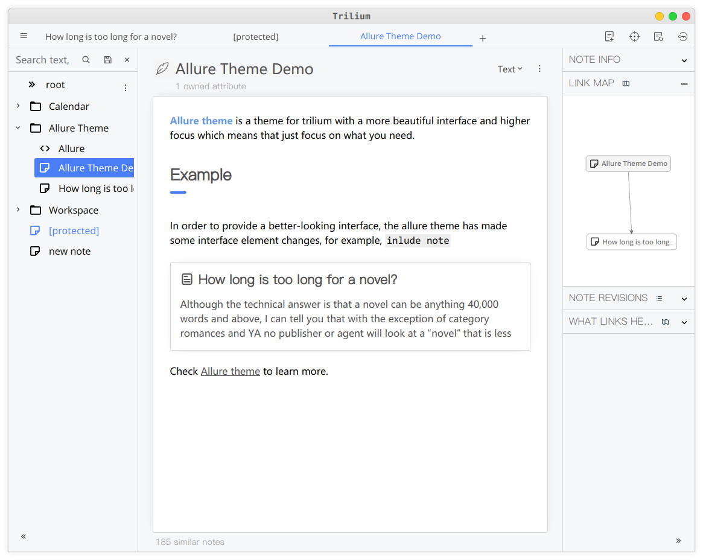
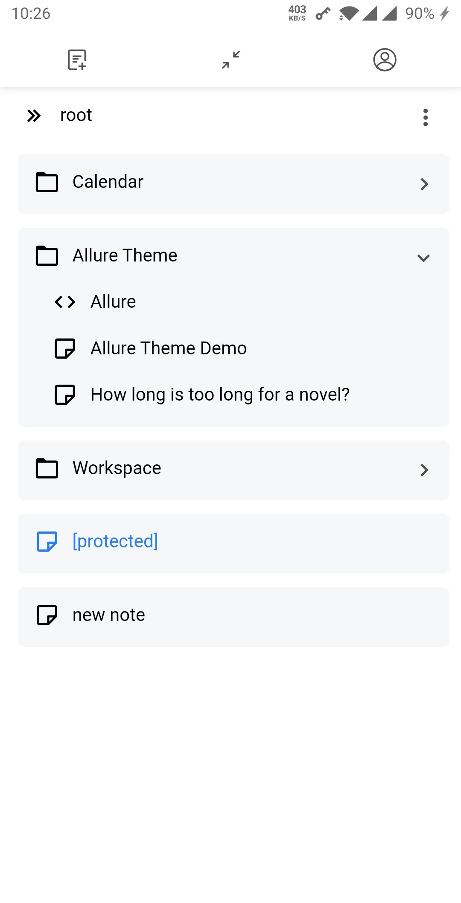
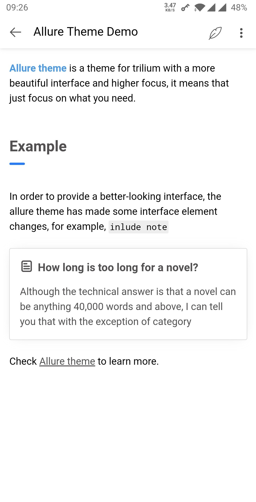

English | [简体中文](./README_zh.md)

## About

**Allure** is a theme for trilium with a more beautiful interface and higher focus which means that just focus on what you need.

trilium is an excellent note taking app with powerful features, however, the excellent features don't lead to a pleasant experience, mainly because the interface with all the content side by side, buttons containing long text, and monotonous without layers is really not good enough, so after a period of time, I create allure theme after using it for a while, hoping to provide a more immersive visual experience.

## Features

1. more minimalist interface
1. more diverse color scheme
1. highlighting important content in a prominent style
1. both mobile and web support

**NOTE: The desktop version has not been tested yet，the buttons in the upper right corner may overlap**

## Screenshot

In order to provide a better-looking interface, the Allure theme has made some interface element changes, take a look by screenshots below

## Steps

Install the theme by following these steps:

1. create a new note in trilium (of type **CSS**) named **Allure**
1. copy the content of [Allure.css](./Allure.css) and paste it into the new note created above
1. add `#appTheme` attribute to the note
1. go to Menu > Options, and select `Allure` as your new theme
1. Press `F5` or `Ctrl` + `R` to reload the page

## Donation

If Allure theme has helped you, considering buying me a cup of coffee

|  |  |  |
|:-:|:-:|:-:|
| **Alipay** | **Wechat pay** | **Paypal** |