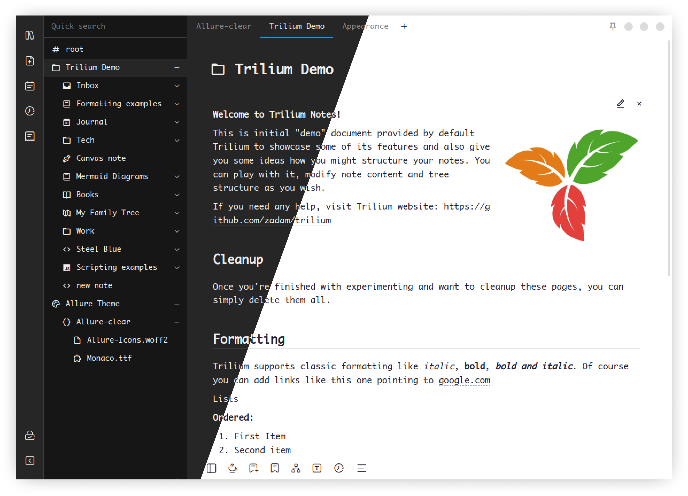

[English](./README.md) | 简体中文

## 介绍

**Allure** 是一个 trilium 主题，提供了更好看、更简约的界面。

trilium 作为一款笔记应用，功能已经足够强大，但是与强大功能对应的确实上世纪画风的界面设计，使用体验很差，主要是因为这种把所有内容并排、按钮包含长文本、单调没有层次的界面并无法让人专注于应该专注的地方，所以我在使用一段时间后，花了点时间写了这个主题，希望能够提供更沉浸的体验。

> 测试版本：`0.54.2`

## 特点

1. 更简约的界面
1. 更舒适的配色
1. 更清晰的布局
<!-- 1. 同时提供手机端和网页端支持 -->

## 截图

为了简化界面，Allure 主题对 trilium 上世纪的画风进行了不少改动

<!-- ## stable（稳定版）和 radical（激进版）有什么区别

radical 版比 stable 版对界面做了更大的改动，目的是尽最大可能精简界面，部分改动可能不适用于所有人。

当前 radical 版的额外改动如下：

1. 去除 similar notes
1. 将 attrs 移至笔记内容的底部
1. 将笔记类型和操作菜单按钮移至笔记内容的右侧 -->

<!-- ## :warning: 注意 :warning:

**不要同时保存超过一个主题样式，否则多个主题的样式将相互影响，会产生不可预料的错误** -->

## 安装步骤

按照以下步骤安装：

1. 创建一个新笔记，类型为 `CSS`，命名为 `Allure-clear` / `Allure-night` *(笔记叫什么名字取决于你要使用哪个主题)*
1. 选择一个主题，然后复制主题的内容到刚才创建的笔记
    - [Allure-clear.css](./Allure-clear.css)
    - [Allure-night.css](./Allure-night.css)
1. 添加 `#appTheme=主题名称` 属性
1. 下载 [fonts](./fonts/) 里面的全部字体，然后在主题笔记右键，选择 `Import to note` 导入全部字体
1. 为每个字体添加 `#customResourceProvider="字体名称.字体文件后缀"` 属性
1. 在 Menu > Options 里面选择 `Allure-clear` / `Allure-night` 主题
1. 按下 `F5` 或 `Ctrl` + `R` 重载页面

<!--  -->

## 已知问题

- [ ] 在一个笔记处于编辑状态时，打开另一个笔记的同时刷新页面，编辑按钮将消失，刷新页面可恢复按钮 *(不确定这个 bug 属于 Trilium 还是 Allure)*
- [ ] 由于属性栏移动到页面下方，导致 Link Map 无法展开全屏显示，同时，复制笔记属性时，也会导致笔记内容滚动 *（能力所限，暂未找到可靠的解决办法）*
- [ ] 移动端样式暂未匹配 *（用户需求不高，本人也无富余时间适配）*
- [ ] 笔记分栏按钮无法跟随操作栏展开和关闭而上下移动 *（布局变动导致，只能等待 Trilium 解决）*

如有意愿，欢迎提交 pr 帮助解决上述问题

## 捐赠

如果你觉得本主题帮助到了你，可以考虑请我喝一杯咖啡

捐赠列表：
- Chee Rabbits
- Jonathon Fuller

感谢你们的捐赠！
